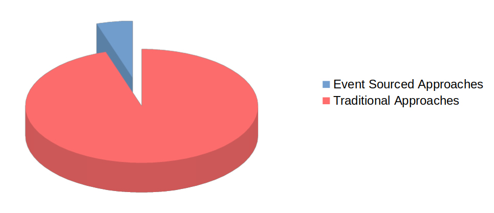
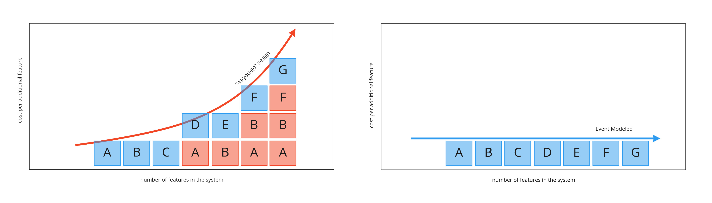

Event Modeling is a method of describing systems using an example of how information has changed within them over time. It was delevolped at **[Adaptech Group](https://adaptechgroup.com)** by **[Adam Dymitruk](https://www.linkedin.com/in/eventmodeling/)**. Event Modeling specifically omits transient details and looks at what the information flow is and what the user sees at any particular point in time. These are the events on the timeline that form the description of the system.

Many systems that have been automated in more recent history do use events as the building blocks of what constitutes state and propagation of information - done via event store databases or regular databases used in a specific way. However, the majority of approaches still rely on state being strictly a view of information at that current point in time - done via a SQL database, document database or other technologies.

The challenge of automating, especially, non-trivial systems is the rising cost curve for further changes as the system grows in complexity. Most of this extra cost of automation has to do with re-work (shown as red boxes below). Event Modeling minimizes the amount of rework by working off of a blue print that can be created in a very short time compared to existing design and modeling methodologies.

Depending on your comfort or ability to use either approaches to automate systems, event modeling can be used to describe multiple strategies or combinations of them. The 2 main articles below explain how to use Event Modeling using either traditional or event-based systems. 

**Please continue reading about Event Modeling in [the original "Event Modeling: What is it?" article](/posts/what-is-event-modeling).**

