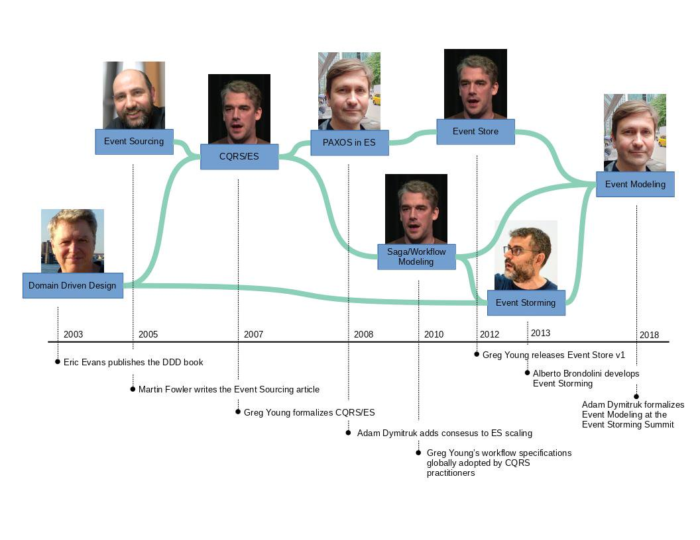
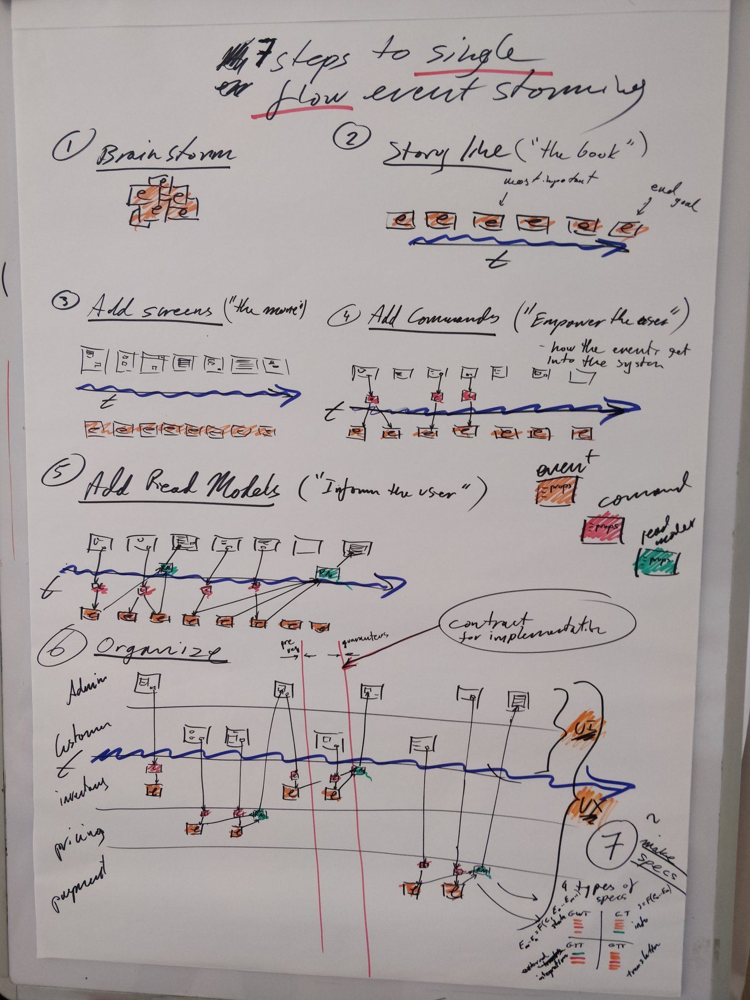

Event Modeling was coined by Adam Dymitruk by building on long-running process specifications that Greg Young used in CQRS/ES systems. Alberto Brandolini's Event Storming sticky notes and collaboration was integrated to adopt the workshop format. The final piece was the UI/UX aspects to complete what more resembles a movie story board. In the recent years many organizations were able to get on the same page with all departments and get their projects done with much greater efficiency.

The name "Event Modeling" was established after the Event Storming Summit in July 2018 in Bologna Italy. It was apparent then that the specific approaches differed significantly. While Event Storming focuses in discovering the problem space, Event Modeling creates a blueprint for a solution. Because Event Modeling doesn't take a long time, it can also act as a problem space exploration exercise by trying multiple solutions.

