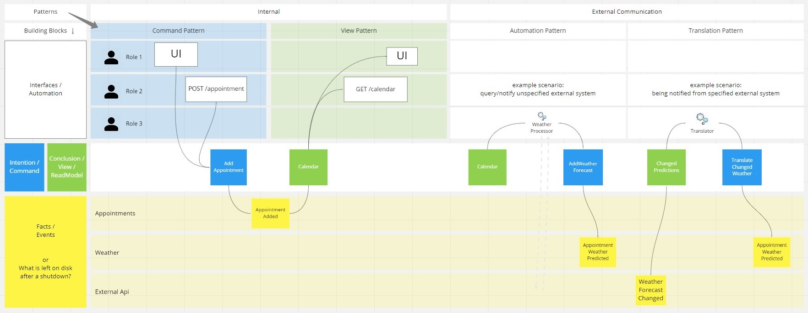
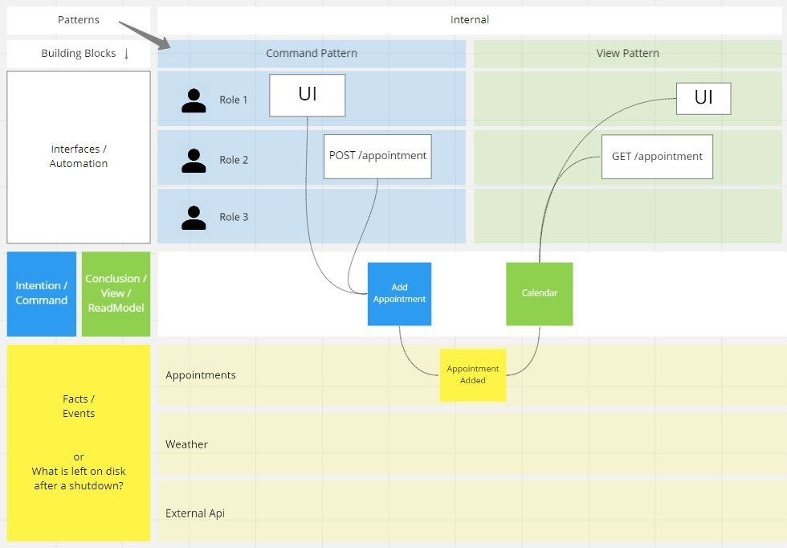
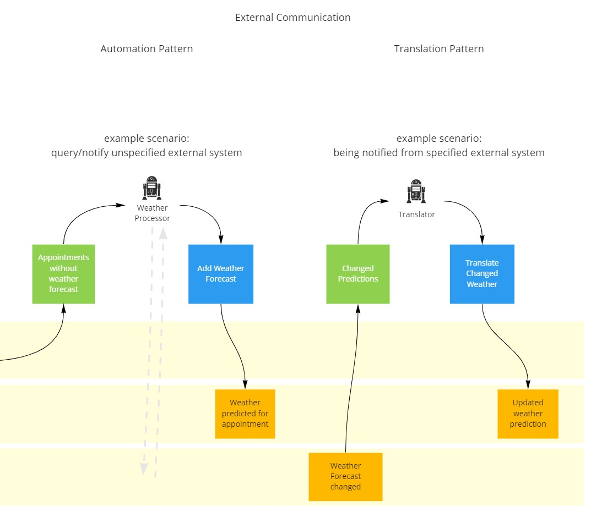

[high res version](cheatsheet.jpg)

The power of Event Modeling lies in its simplicity. This cheat sheet summarizes the four building blocks that can be utilized in four different patterns.

When you host an Event Modeling session, it is good to get people on board quickly. Use this sheet for your own understanding or bring it to a workshop in order to make the start easier for people that are new to Event Modeling.

# 4 Building Blocks
On the left side of the cheat sheet the four possible building blocks are described:

* **Trigger**: What 'triggers' a use case? It can be a user via a UI or it can be a some external piece of software calling our public API. Or it can even be a robot aka an automated process.
   
   
Describe it via a simple wireframe or the route of an http endpoint. You can also involve designers to show the full-fledged design, but the main focus should remain on the information flow. So for the start it´s also fine to just use an empty white box with a name for the piece of UI.
* **Command**: Describes an intention to change the state of the system. Enrich it with parameters that are relevant.
* **Event**: Describes a business fact that mutated the state of the system and was saved to disk. This is the most important piece for understanding the system. Always find a name for it that explains what happened in the context of the business. Also put all relevant information in it. The more realistic the data the better.
* **View**: Describes a query that reads, interprets and curates previously produced data and provides it for a specific user interface. Or the queried data could also result into a report or another automated process that works with the data.
   
   
  For example in a table-based world it can be implemented by a simple reading SQL query. In a complex scenario it could be a read model that aggregates events and persists the result somewhere.  

# 4 Patterns
On the right side of the sheet, the four possible patterns are shown and how the building blocks will be connected within the patterns.

#### Command Pattern
**Trigger -> Command -> Event(s)**

The Command Pattern describes a state change and its way from the start (what is the trigger?) to the end (what is the state change?). It starts with a white box (Trigger), followed by a blue box (Command) and then one or multiple yellow boxes (Event). At first each box should be given a name in order to give the use case a meaning in the context of the business. After that work your way to a more fine-grained description and put relevant parameters or attributes to the boxes.

#### View Pattern

**Event(s) -> View**

The View Pattern connects existing events from the board to a green "View" box. That leads to a quick overview of what information will be used by it. On the other hand that means that only information that already exists can be interpreted and presented in the view. So  it should be noticed quickly if anything is missing or forgotton. Also give the "View" a meaningful name. People from the business wil love the better understanding that they get when you show how you plan to query the data.

### Automation Pattern
**Event(s) -> View -> Automated Trigger -> Command -> Event(s)**

Use this pattern whenever the system should do something automatically. If you look at the chain of the pattern, you see that it´s nearly the same as a combined form of a Command and View Pattern. With a robot sitting in the middle. You could describe the same thing, replacing only the triggering robot by a user. You then lose the automation, but the information flow would be the same.

Event Modeling accomplishes a really good thing for the understanding of good software architecture here. The automation works the same way as a user would use the system. Some process observes some data via a view and triggers a business case, if the conditions are met. For this case Adam teaches, that the view that the automated process monitors, is a simple todo list. For each row the automated process calls a use case, which provides a new event. And that new event gets then interpreted by the Todo-View which will tick that row off. So no row will cause a use case to get called twice. That way the complexity of the automated process is never above reading a todo list and making a call for it. There is no business logic in there.

### Translation Pattern
**Event(s) (source system) -> View -> Automated Trigger -> Command -> Event(s) (other systems)**

The chain of building blocks looks the same as with the automation pattern in the first place. That´s because it is the same thing. The only difference in this pattern is, that the translation pattern is used for transferring knowledge from one system into another system. Whenever you have to tell another system that something happened, use this pattern.

There is a restriction with this pattern. On the read side of the pattern you can only read events from one system. The write side has no limitation. The translator could publish the knowledge of one system to several other systems via a Pub/Sub mechanism.

### Slicing
Each pattern, when modeled on the board, could be seen as a 'slice'. A slice is the smallest possible work that can be handed over to a developer for implementation. That´s because everything that a developer would need to know is explained in that slice. From the top of the architecture all the way down to the persistence level.

[Cheat Sheet on Miro](https://miro.com/app/board/uXjVOia7ydY=/?share_link_id=194982904636)