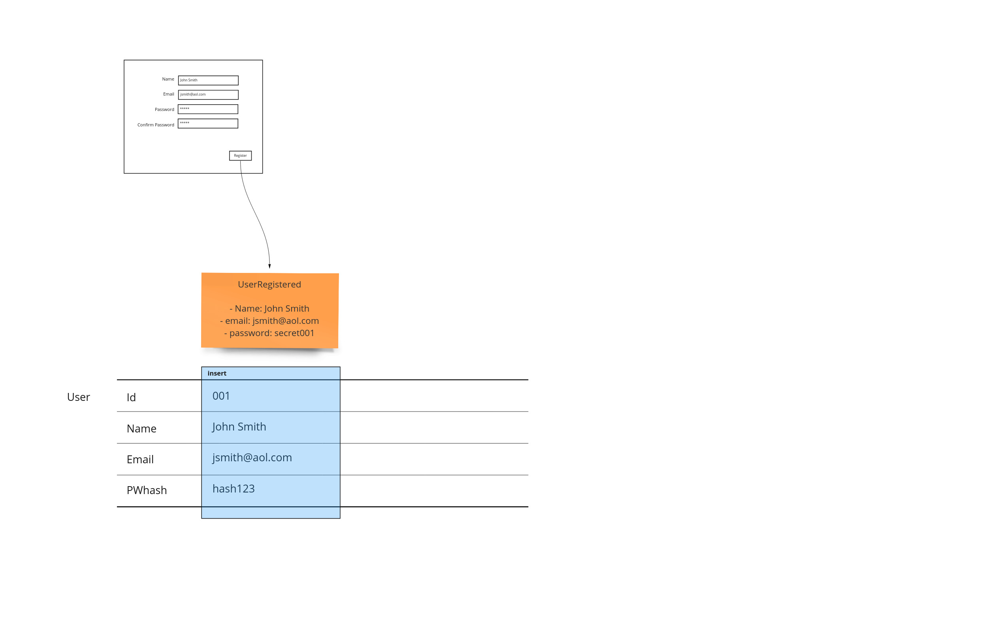
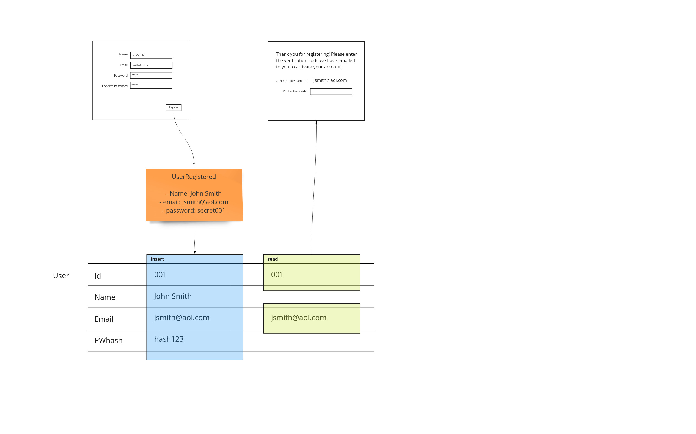
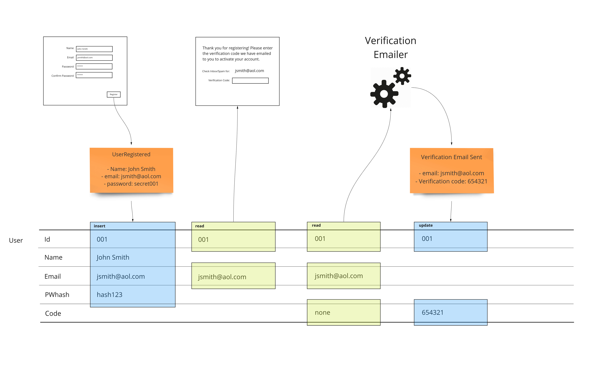
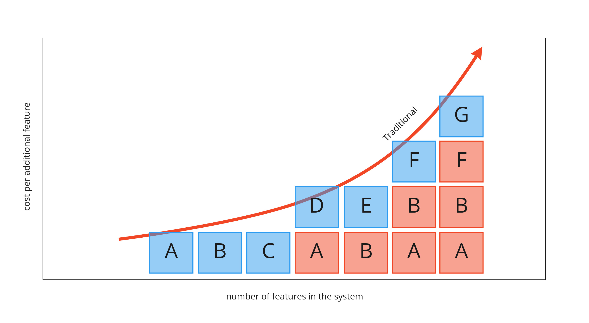
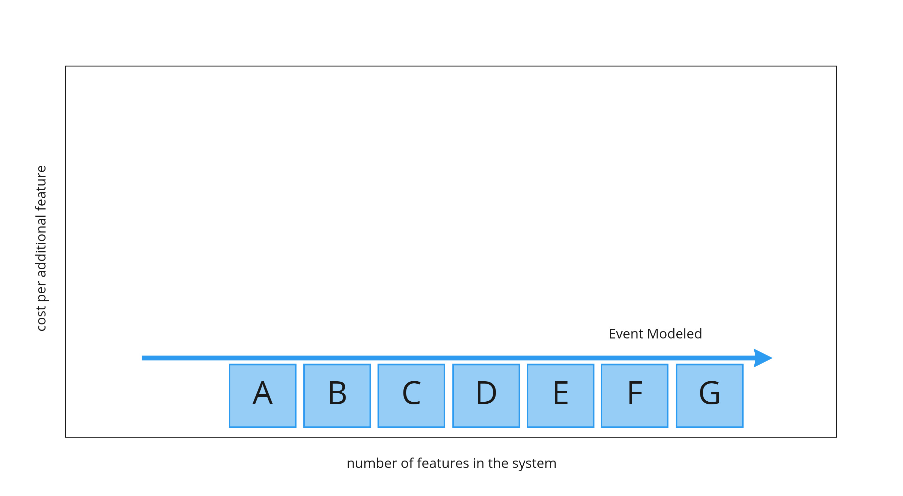

> "Show me your flowcharts and conceal your tables, and I shall continue to be mystified. Show me your tables, and I won’t usually need your flowcharts; they’ll be obvious" -- <cite>Fred Brooks, author Mythical Man-Month</cite>

This fundamental insight is an idea that will allow us to use a much simpler methodology by which to describe systems - almost any information systems. By focusing on state and not the logic of a system, we can infer what it is doing instead of being burdened by the minutia of the details of automation. This is the premise of Event Modeling: shed the low-value aspects of system design the industry has adopted. It extends "specification by example" into the realm of system design.

In this post we'll explore taking advantage of using state from both the user's perspective and the actual storage that backs a system. The difference in these perspectives will show how associations of different parts of the system with one another are responsible for rising costs as complexity grows if we don't design the system to take them into account from the beginning.

The key aspect of the approach is to show the system changing over time. To show an easy example we will start from the left and work our way to the right to see how a system is designed logically and with only the pieces of information we need in order to accomplish the example workflow.

## User Interface

We begin by designing the screen that a user will see initially.

## Events

Events happen - whether we store them or not is our choice. In this case we don't - at least not directly. We show what the user is inputting into the system. We show how this information is recorded. In this case we can show that the system requires the storage of a hash, because storing passwords directly is not secure (see the following section). Because we have this shown on our event model, we can discuss, if need be, to non-technical people why this is important and where it comes into effect when they interacting with the system.

## Tables

So far we have captured what the user saw, and then what they ended up doing in terms of facts as events. The table representation is represented by a set of swim lanes that correspond to records - or rows. This allows us to see where data is updated, inserted, deleted and more importantly attached to different workflow steps. Since this form of representation takes a lot of room, it is shown at the bottom so it will not displace the other artifacts. 

## Views

As we move to the next page in our application, we may show some of the information the user has entered. It's important to show exactly where this information is coming from. This allows us to show where each step of our workflow has its dependencies. Even though the id is not shown on the page, it is important information that is used to get the email we are interested in.

This completes the very basic input and feedback cycle that makes up Event Models. In the next installment to this post, we will add further functionality that will show how we can use Event Modeling to not incur this increasing cost. We'll also address the same patterns for automation and translation but without the event sourced paradigm of the previous post.

## Automation

We show the email being sent as a service that runs for us. We can show exactly where the state of the workflow in sending the verification email is exactly. This may already impact some of the work that we have done before had we started implementing it. Because we are planning, we can make sure that the schema we create is done properly the first time. We'll use a column called "code" to track the state of email verification.

## Re-work

Being efficient with storage requires re-opening the design of existing tables as we add new features to our system. It is this rework that is responsible for features costing more and more as the size of the whole system grows. The following graph shows features A through G becoming more expensive. They are propped up needing to adjust previous already completed functionality.

Feature D requires the rework of feature A. Feature E requires feature B to be cracked open and adjusted. It gets worse as the solution grows. Feature F depends on both features A and B both being re-addressed. This can get much worse as this type of dependency can start to stack. Feature G depends on adjusting feature F which precipitates to refactoring features A and B again. 

We have an example of this when we added the verification feature to our sign up example at the beginning of the article. When we needed to store the verification code, we had to add a column to the user table. 

The key point is: If we were implementing the solution as we were designing, we would have to go back and add that capability to the insert statement. 

If we, however, wait until we find a place for all data in the system, and describe how it changes in an event model, we eliminate nearly all the rework. 

Being able to get work that can effectively cost the same amount no matter when it is programmed is essential for removing risk from projects by having a reliable budget and schedule.

## Small Design Up Front (SDUF)

The scapegoat of modern approaches like agile, waterfall is a name given to doing too much planning so we don't get going soon enough. This was always painted as a very costly investment of a year in very bureaucratic large organisations.

"No Big Design Up Front" known as BDUF has been a war-cry of agilists to get going to cut through red tape and get things done - relying on tight feedback loops to take care of design instead through "emergent design". 

But what if we didn't need "Big" design? Event Modeling is the idea that by focusing on the important parts of design only, we effectively make it small. Because it's small, we can do it quickly.

## Data Loss

What happens when we update information? It is deleted. We lose a piece of history that may be crucial in helping us troubleshoot issues in our solution. The event model shows where we have these losses. We can discuss whether we should account for the history of some more important records - or if it's worth it to switch to a loss-less store entirely.

## Audience

One would think that this is something that would be more technical compared to the event model of an event sourced systems. That may be true, but what is the cost of all roles in an organization understanding where the information they deal with is located. This should not be a bigger burden for understanding. So we must aim to keep from adding any code or logic to the event model. Just like before, if we stick to following the evidence of how information is changing over time in the system, we speak to a much larger audience. Understanding the system is key to everyone having insight into the complexity and effort needed to deal with the demands of the business.

## Legacy Code

When we look at really brittle systems that have been over-complicated, we had a strategy to freeze the codebase and instrument some listeners on the state to enable a side-car approach to bug fixes and extending the system's functionality. However, we may now use the Event Model to analyze the system from the point of view of state.

### The Refactor

Traditionally, trying to refactor a code base was done with a focus on the structure of the logic. This certainly limited the audience to only developers. The scope of the changes can now be shown by ensuring that areas of code we want to address will certainly not affect state in places we don't expect. This audit allows us to define scope to what our refactoring is going affect. This will allow us to rely on a smaller number of regression tests to ensure we have not affected other areas that are working or need to remain unchanged.

### The Rewrite

If we manage to get a sufficient amount of example workflow data from our event model in a traditional system, we are in a better situation to reach success when we re-implement from the beginning. Like with Event Modeling an event sourced system, our coupled workflow rewrite efforts should give us estimates that are drawn from empirical data that can be anchored in other constructs exhibited by this model such as # of workflow steps affected by when implementing specific vertical slices.

Although not as straight forward as the event sourced approach, we still can get better estimates based on empirical data. The removal of subjectivity is key to having a more reasonable expectation of a project.

## Conclusion

Fred Brooks was right about the power of only considering tables. His statement can be extended in meaning to apply to any form of information persistence in a system. Even though we don't store events, they still are the most effective way to describe what a system is supposed to be doing - especially if done by example.