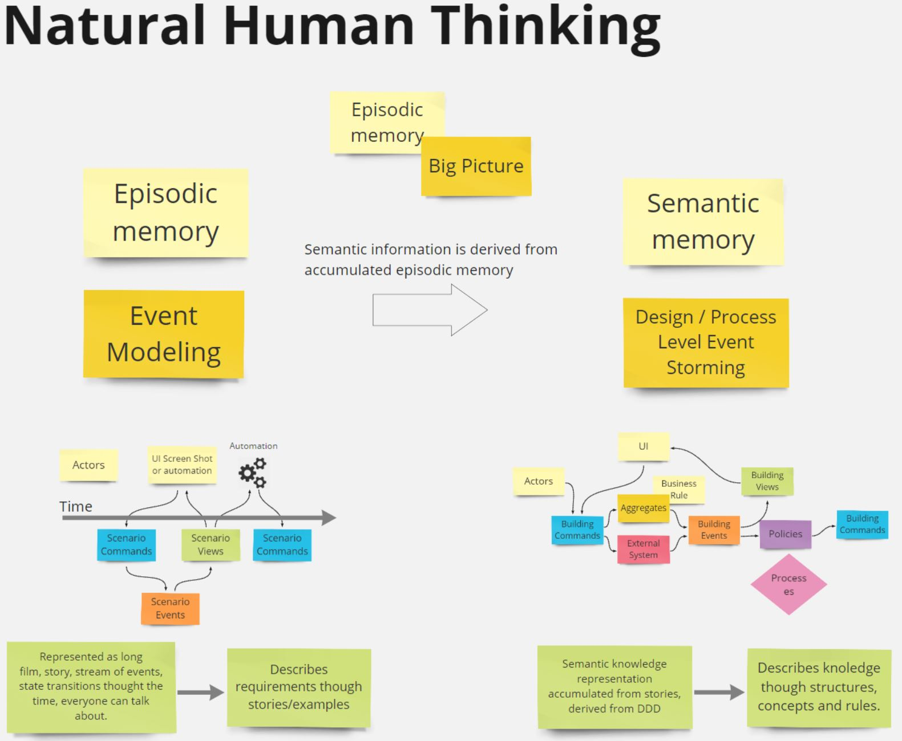

 

IT seems to mimic so much from how the **human brain** works. Similarities are striking. It's just as if we were to build an artificial brain, sic. Let's dive in:
* human short memory (example: you can repeat a sentence that you heard, but not yet understand it) vs processor cache
* human operation memory vs well operation memory (RAM)
* human long term memory vs disk space

Let's imagine the brain as a machine that processes information. It can learn so fast, process loads of data instantly. How it acquires information/learns - this how we should gather requirements for IT systems. So how is knowledge constructed, where is it stored and how? 
Human memory can be divided into 2 categories: This is semantic memory and episodic memory. Both are part of explicit (conscious, declarative) memory. Semantic memory refers to general world knowledge that we have accumulated throughout the experience - that is stored in episodic memory as a stream of events. Episodic memory can contain snapshots of images, scenes that happen one after another, it's a book of stories with images and with no conclusions. The facts, ideas, and concepts can be derived from it, thus they build semantic memory, that might be expressed in higher-level brain language (according to some scientists). 

# So how is that related to Event Storming and Event Modeling?
In the beginning, we observe, we use episodic memory, we store a history of events. This would correspond to big-picture event-storming. We explore lots of stories. However, if we want to do a deep dive into certain stories we would use Event Modeling - we create long stories, that show how information is processed through time, step by step, just as if we would see how information flowed throughout our company in a year's time.

When humans interact with the outer world, make decisions, they use a lot of heuristics, not necessarily based on pure knowledge. However, from a robot-like-employee, that processes information, we would rather demand some rationality. Decisions should be made based on knowledge. How to get it? We have observable events or history of facts, that result in the creation of conclusions - views/read models/reports - the knowledge. This is used for making decisions and thus command to do something. Those 3 building blocks: events/history of facts, conclusions/views, intentions/decisions/commands, seems the only one required to create a move that shows how we think/process information. This way requirements for information systems can be sufficiently described with examples and this is the heart of EventModeling.

Creating such a story does not require any special technical knowledge - it's just a story. This story can be later implemented. However, if you had asked, what are the rules or policies, it would be a bit harder to point them out directly out of Event Modeling. 

The structure of concepts and rules - semantic memory - is well represented through Event Storming Design-Level or Process-Level. This looks as if we distilled our stories (role-model-examples) into structured knowledge, that contain some abstract concepts & rules. However, talking about it requires a bit of DDD knowledge - we need to understand those abstractions, we use a different part of our brains to do it. Maybe this is the reason why EventStorming Design Level and Process Level is a bit harder for non-technical audiences. Even if there is an expert that won't use a word like 'Aggregates' or 'Bounded contexts', abstract thinking is still required. Why? Because we are discovering abstracts such as politics, rules. This requires a bit more cognitive load than just reading a story.

# So which one to use? Which one is better? 

Before answering let's take a look at a complicated living information system. Law. From Wikipedia: Its a system of rules which a particular country or community recognizes as regulating the actions of its members and which it may enforce by the imposition of penalties. 
And here we have: in the USA we have a law based on precedents vs in most countries in Europe law is based on regulations. Both work. Both have some flaws. 
Law based on precedence looks like a system designed though Event Modeling, embracing living examples of stories, where rule-based European law looks like a system designed through Event Storming Design Level, requiring a deeper knowledge of concepts, rules, and structures. 
What would be better, find examples to follow, or find rules to follow?

# Information Processing Dualism

The human brain developed episodic memory and semantic memory - they work together. Thus our natural way of working depends on the context. Why didn't we developed a system that can show requirements from those 2 different points of view? Wait, wait... & stay tuned!
