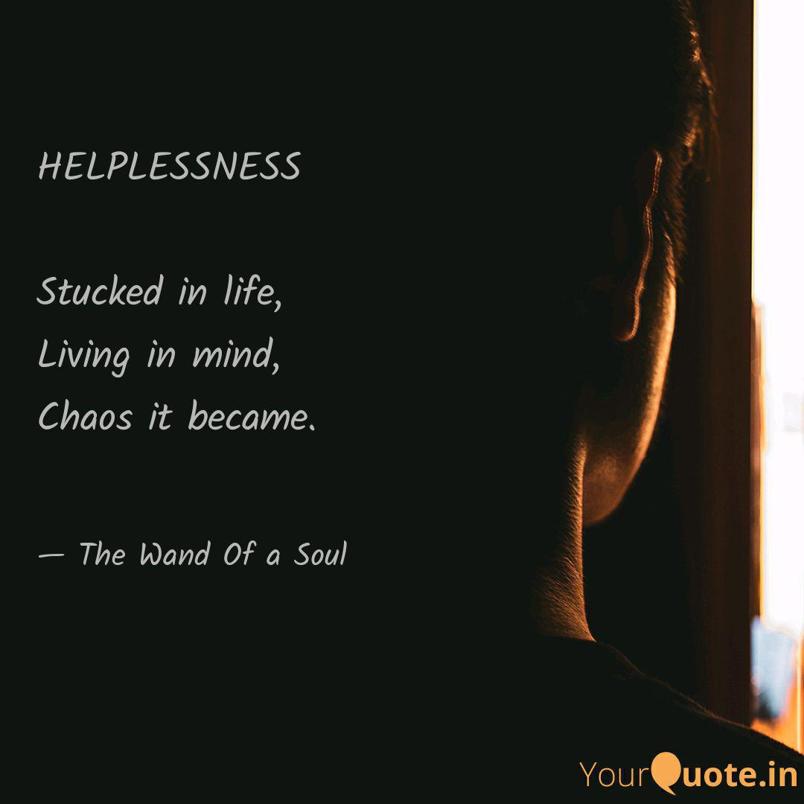

> "Context Without Measures is Helplessness; Measures Without Context is Chaos"

It is no surprise that my five-year old son thinks that Google Home is a person. He talks to it like a person; giving thanks when it does what he wanted, and gets exasperated when it doesn't. Given this context, what would great software be like if it was a person? I would argue that a hallmark of great software is that you think of it like a servant, or better yet, a butler. If we have one, what characteristics would such a person have? I would argue that great software user experience, like great people, provide the right context and measures to act upon receiving the context.

It is important we define context and measures properly. In terms of software and event modeling, context is the situation within which a command may occur. If too little relevant information is given, in which context becomes unclear or missing, the interaction experience will be poor. Similarly, if too much irrelevant information in which context becomes over-saturated or misleading, the interaction experience will be equally poor. A delicate balance must be struck between those extremes, and this balance must be accounted for in every interaction between software and user.

This delicate balance also applies to measures, an equally important aspect of great user experience. Measures is the collection of commands that a user can actually perform at any given context. Not providing a means to issue a command when all the context is right in front of you can be infuriating. Equally frustrating, providing a means to issue a command, only to find out that you can't actually do so, or even worse, that command had unintended consequences that user never wanted (due to lack of or misleading context). The main takeaway is that context and measures are not vague or abstract. Viewing any actual screenshots of working software, and you can determine context and measures for every event state. How closely the software provides context and measures matches users' expectations of context and measures directly leads to higher satisfaction and more revenue for the software seller.

Many of us already know this, but this knowledge alone doesn't reveal how to incorporate great context and measures building to software user experience. This isn't surprisingly, as knowing how to drive a race car or what makes a great race car, for instance, doesn't give us much insight to how to build a great race car. While various processes have been tried, I would argue that event modeling as a process succeeds in defining context and measures better than all other processes. Why? Because event modeling is easy to understand by the most important stakeholders, software's end users, the ones who are actually going to rely on the software for their well being.

Anyone can look at an event modeling diagram and decipher what it's conveying in a few minutes. Take a look at a sample event model below:

[high res version](../what-is-event-modeling/blueprint_large.jpg)

The model tells stories, in chronological order, of how context moves from time A to B, the possible measures available in each context, and depending on the actual command chosen, divergent paths with new context / measures, and such. Any deficiencies in context, such as realizing that in order to book a room for next Saturday, a hotel staff member must know what rooms are actually available, are apparent. Any deficiencies in measures, such as ability to cancel a reservation, are also apparent. 

It is hard to overemphasize how important it is to have both context and measures, bound by time and specific user personas, in one place. Consider the definition of user experience from Nielsen Norman Group, world leaders in Research-Based User Experience:  https://www.nngroup.com/articles/definition-user-experience/

> The first requirement for an exemplary user experience is to meet the exact needs of the customer, without fuss or bother. Next comes simplicity and elegance that produce products that are a joy to own, a joy to use. True user experience goes far beyond giving customers what they say they want, or providing checklist features. In order to achieve high-quality user experience in a company's offerings there must be a seamless merging of the services of multiple disciplines, including engineering, marketing, graphical and industrial design, and interface design.

How do you meet exact needs of the customer, without fuss or bother, if your entire organization cannot concisely communicate and agree on what customers need to know (context) and what actions customers can take (measures)? This understanding needs to be complete at any point of the interaction, from beginning to end, without gaps. What separates great UX from bad are the number and size of these gaps of understanding. That is what event modeling excels at - having those gaps visible and provide means to fill them in for everyone to see.

The definition also highlights a need for a universal language that engineers, markers, graphical designers, and interface designers can understand. After all, without one, how do you work together, especially remotely in the time of Covid-19? Through my 15+ years software industry experience, I have been at the epicenters of these attempts to collaborate, some more successful than others, but not once until I witnessed event modeling in action that such an universal language not only exists, but a giant leap in human ability to design software that truly brings joy for users to use.

---
About the author:

[Eric Lau](https://www.linkedin.com/in/ericlflau/) brings 15+ years of experience as a Senior Solutions Architect for Adaptech Group; currently providing expertise in Event Modeling, CQRS / Event Sourcing, and all tools required to lead a team to build great UX software.

