## [Motivation](#motivation) {#motivation}

### [Moore's Law](#moores-law) {#moores-law}
Digitized Information Systems are a relatively new concept. Humans have been working with information systems for thousands of years. Over centuries banks, insurance companies and many other large scale organizations have managed to succeed.

With the advent of the transistor, the speed and accuracy of processing information increased by orders of magnitude. What did not gain the same quantum leap is digital storage. This imbalance caused information systems to be optimized for a very small amount of online information. You can see this in the advent of RDBMS technology. What it means is that the compromise was to throw information away.

### [Human Memory](#human-memory) {#human-memory}

Story telling is something that enables humans to pass knowledge on to subsequent generations and relies heavily on how we store memories - whether logical, visual, auditory or other. This is important because there is a parallel with how information systems were constructed. There is a "memory" of all your visits to the doctor. It's the ledger of the forms that are filled in with each visit.

Specifications by example are a way to show how something is supposed to work. This can be seen in successful practices in software such as Behaviour Driven Development. This works well because we communicate by stories more effectively. It ties back to story telling as a way to keep information in society. Our brains are built for it more than they are built for flow-charts and other formats. 

## [Life After the Dawn of the Computer Age](#life-after){#life-after}

In recent decades, Moore's Law from the side of online storage has caught up. This means that after the initial few decades of living with computer systems, our information systems that are now digitized can use the mechanics that made them effective throughout history.

This means we have enough storage to not throw away information. The ability to be able to keep a history of all that has happened allows systems to be more reliable by means of audit and specification by example that literally translates to how the system is implemented.

We also have enough storage to have a cache of different views into what has happened in the system. This is important as we now have made the task of trying to fit all our concerns into one model an unnecessary constraint. In 1956, an IBM harddrive that stored 10MB cost $1M and required $30K monthly budget.

### [Reality of Current Tooling](#reality-of-current-tooling) {#reality-of-current-tooling}

So we are now at a cross-roads where we have very mature tooling, but that tooling is made for solving a problem we no longer have - being efficient with storage constraints. The new tooling that we see on the rise is what information systems always had: a ledger of what happened - storage is not a major issue anymore. There are many benefits to keeping ledger. They represent the natural way we think about systems - digital or not.

## [The Model That Works](#the-model-that-works) {#the-model-that-works}

[high res version](blueprint_large.jpg)

Time is a concept that is now a core piece of describing a system. The components and classes that we saw in computing are not as important. We can show, by example, what a system is supposed to do from start to finish, on a time line and with no branching - again to make use of that memory aspect of our brains. This is the Event Model. It is used to follow all field values in the UI to the storage of those value to where they finally end up on a report or a screen. It's generally done with sticky notes on a wall or whiteboard - or an online version of a whiteboard. We'll see that simplicity is at the heart of the approach as we will only use 3 types of building blocks as well as traditional wireframes or mockups. Further to keep things simple, we will rely on only 4 patterns of how we structure the diagram.

### [Simplicity](#simplicity) {#simplicity}

When we want to adopt certain practices or processes to help one another understand and communicate, it is inversely proportional to the amount of learning individuals must do to be proficient in those methods. Put in another way, if an organization chooses to adopt a process called "X", and X requires one book and a workshop that takes a week to go through, it nullifies the effectiveness of X, and here's the worst part, **no matter how good X is**.

When the book is a required reading by the people in an organization, everyone will say they have read it; only half will have actually read it; half of those will claim they understood it; and only half of those will have understood it; and half of those will be able to apply it.

This is why Event Modeling only uses 3 moving pieces and 4 patterns based on 2 ideas. It takes a few minutes to explain and the rest of the learning is done in practice, transparently where any deficiencies in the understanding of even those few core ideas are quickly corrected.

This is how you get to an understanding in an organization.

### [Events](#events) {#events}

Let's say we want to design a hotel website for a hotel chain for allowing our customers to book rooms online and for us to schedule cleaning and any other hotel concerns. We can show what events, or facts, are stored on a timeline of the year in that business. We can pretend we have the system already and ask ourselves what facts were stored as we move forward through time.

### [Wireframes](#wireframes) {#wireframes}

To bring in the visual part of story-telling we show wireframes or web page mockups across the top. These can be organized in swim-lanes to show different people (or sometimes systems) interacting with our system. We also show any automation here with a symbol like gears to illustrate that the system is doing something. This has an easy to understand set of mechanics of a todo list that a process goes and does and marks items as done. In our hotel example, this could be a payment system or notification system.

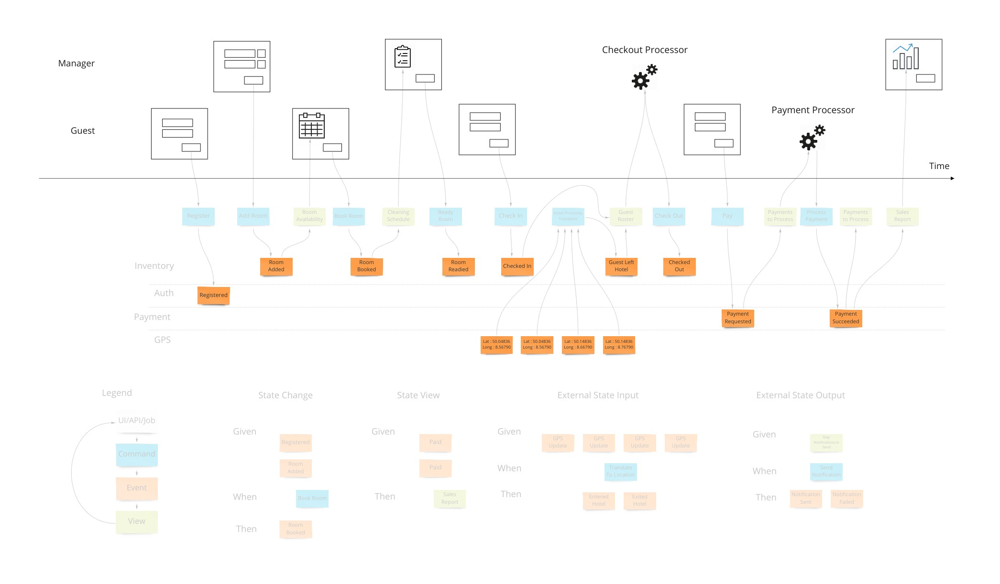
[high res version](innovate_large.jpg)

At this point we have enough to be able to design some systems with some UX/UI people. But there are 2 very fundamental pieces that must be added to the blueprint which show 2 core features of any information system: Empowering the user and informing the user.

### [Commands](#commands) {#commands}

Most information systems must give an ability for a user to affect state of the system. In our example, we must allow the booking of a room to change the system so that we don't over-book and when that person arrives at that future date, they have a room ready for them.

Intentions to change the system are encapsulated in a command. As opposed to simply saving form data to a table in a database, this allows us to have a non-technical way to show the intentions while allowing any implementation - although certain ones have advantages as we will see.

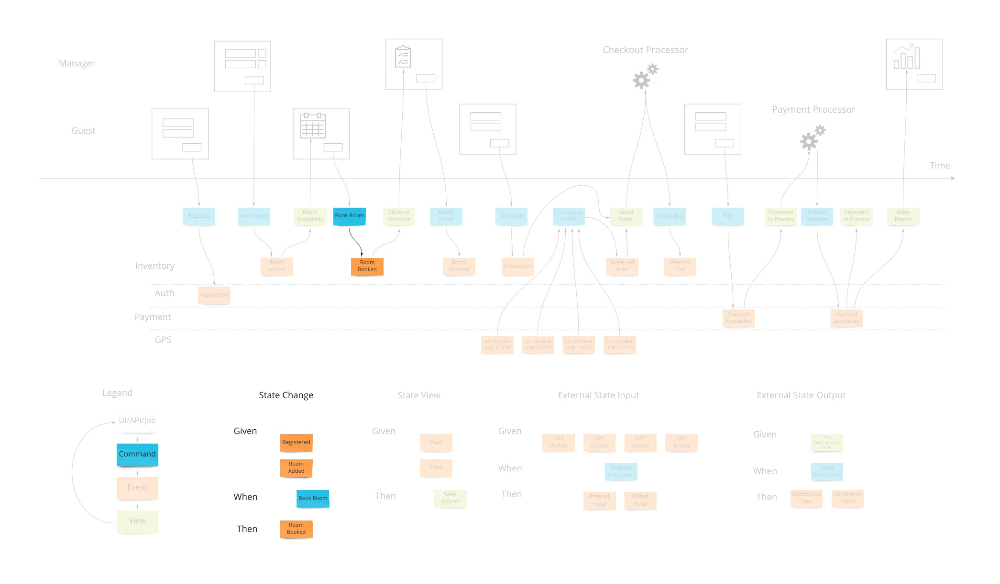
[high res version](empower_large.jpg)

From the UI and UX perspective this drives a "command based UI" which goes a long way into helping make composable UIs. With this pattern, it's a lot clearer what the transactional boundaries are both from the technical and business perspectives. The hotel guest either registered successfully or not.

When there are nuances to what the prerequisites are for having a command succeed, they are elaborated on "Given-When-Then" style specifications. This is, again, a way to tell a story of what success looks like. There may be a few of these stories to show how a command can and cannot succeed.

An example might be "**Given**: We have registered, and added a payment method, **When**: We try to book a room, **Then**: a room is booked." This form of specification is also referred to as "Arrange, Act, Assert" and in the UX/UI world "Situation, Motivation, Value".

### [Views (or Read Models)](#views) {#views}

The second part of any information system is the ability to inform the user about the state of the system. Our hotel guest should know about what days are available for certain types of rooms they are interested in staying in. There are usually many of these and support the multi-model aspect of information systems.

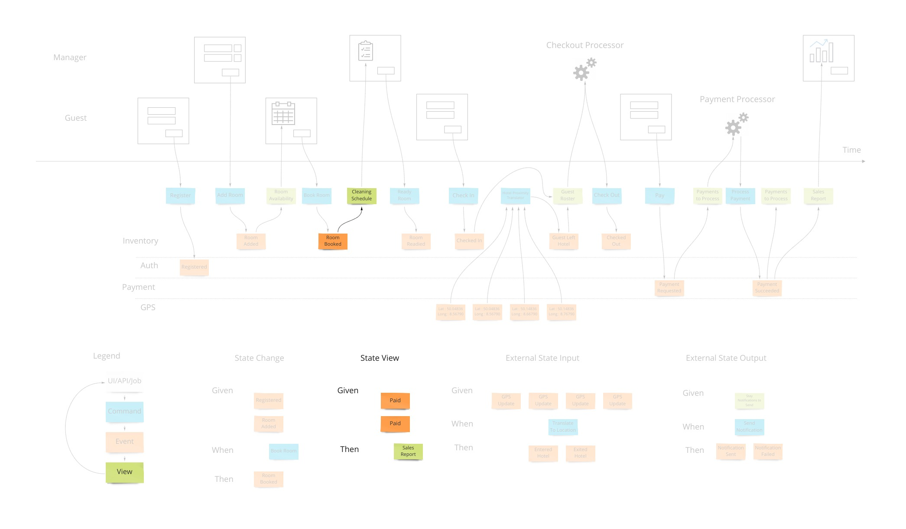
[high res version](inform_large.jpg)

A view into the facts already in the system has been changing as these new events were being stored. In our hotel system, this calendar view was being updated as new events that affected inventory were happening. Other views may be for the cleaning staff to see which rooms are ready to be cleaned as events about guests checking out are being stored.

Specifying how a view behaves is very similar to the way we specify how we accept commands with one difference. The views are passive and cannot reject an event after it's been stored in the system. We have "**Given**: hotel is set up with 12 ocean view rooms, ocean view room was booked from April 4th - 12th X 12, **Then**: the calendar should show all dates except April 4th - 12th for ocean view availability".

### [Integration](#integration) {#integration}

We just covered the first 2 patterns of the 4 that are needed to describe most systems. Systems can get information from other systems and send information to other systems. It would be tempting to force these 2 patterns to be an extension of the first 2 and share the same space. However, these interactions are harder to communicate as they don't have that human-visible aspect to them and require some higher level patterns.

### [Translation](#translation) {#translation}

When we have an external system that's providing us with information, it's helpful to translate that information into a form that is more familiar in our own system. In our hotel system, we may get events from guests' GPS coordinates if they opted in to our highly reactive cleaning crew. We would not want to use longitude and latitude pairs as events to specify preconditions in our system. We would rather have events that mean something to us like "Guest left hotel", "Guest returned to hotel room".

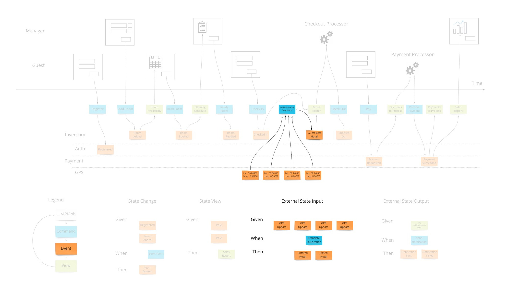
[high res version](understand_large.jpg)

Often, translations are simple enough to represent as views that get their information from external events. If we don't use them as any "Given" parts of tests, the values they store in that view model are simply represented in the command parameters in our state change tests.

### [Automation](#automation) {#automation}

Our system is going to need to communicate with external services. When the guests in our hotel are paying for their stay when they check out, our system makes a call to a payment processor. We can make the concept of how this occurs with the idea of a "todo list" for some processor in our system. This todo list shows tasks we need to complete. Our processor goes through that list from time to time (could be milliseconds or days) and sends out a command to the external system to process the payment, as an example. The reply from the external system is then translated into an event that we store back in our system. This way we keep the building blocks that we use in our system as something that's meaningful to us.

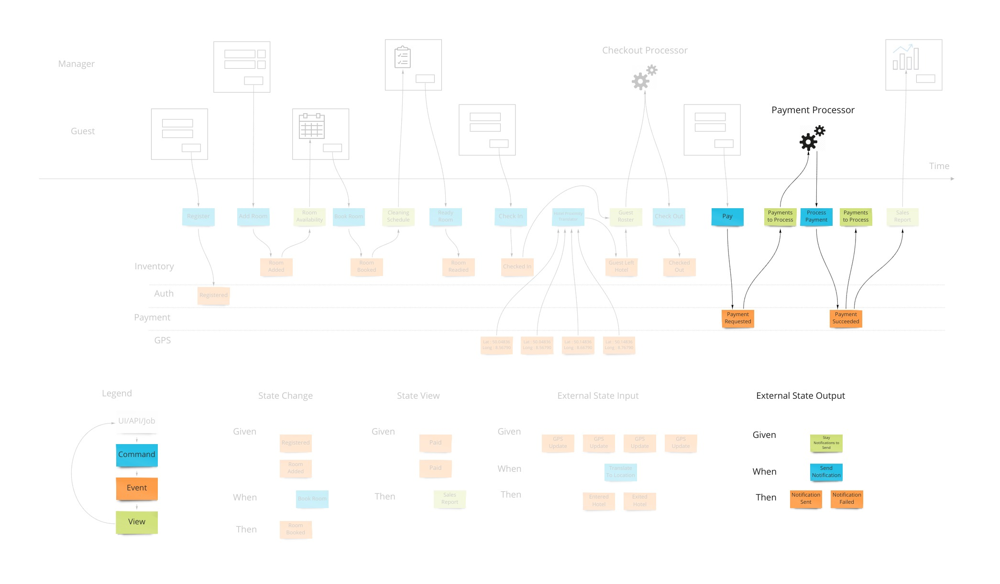
[high res version](automate_large.jpg)

We show this by putting a processor in the top of our blueprint which has the wireframes. This shows that there are things not evident on the screen but are happening behind the scenes. A user may expect a spinning icon to indicate a delay due to background tasks needing to finish. The specification for this has the form of "**Given**: A view of the tasks to do, **When** This command is launched for each item, **Then** These events are expected back."

In reality, these may be implemented in many different ways such as queues, reactive or real-time constructs. They may even actually be manual todo lists that our employees use. The goal here is to communicate how our system communicates with the outside world when it needs to affect it. 

## [Workshop Format - The 7 Steps](#seven-steps) {#seven-steps}

Event Modeling is done in 7 steps. We explained the end-goal already. So let's rewind to the beginning and show how to build up to the blueprint:

### [1. Brain Storming](#brain-storming) {#brain-storming}

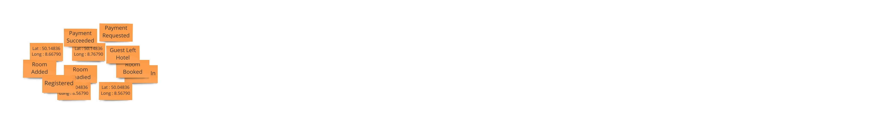
[high res version](Step-1_large.jpg)

We have someone explain the goals of the project and other information. The participants then envision what system would look and behave like. They put down all the events that they can conceive of having happened. Here we gently introduce the concept that only state-changing events are to be specified. Often, people will name "guest viewed calendar for room availability". We put those aside for now - they are not events.

### 2. [The Plot](#the-plot) {#the-plot}

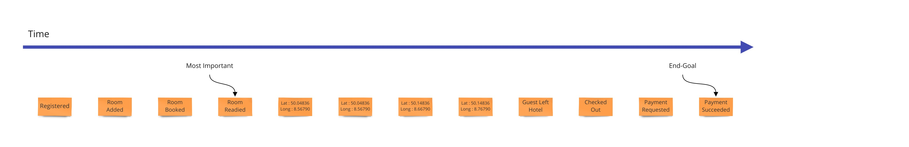
[high res version](Step-2_large.jpg)

Now the task is to create a plausible story made of these events. So they are arranged in a line and everyone reviews this time line to understand that this makes sense as events that happen in order.

### [3. The Story Board](#the-story-board) {#the-story-board}

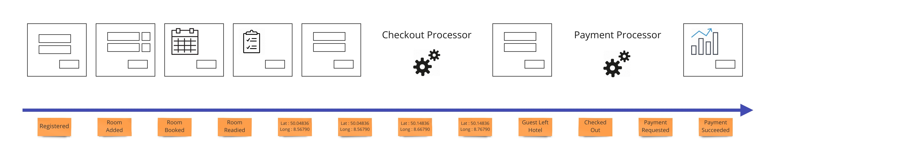
[high res version](Step-3_large.jpg)

Next, the wireframes or mockups of the story are needed to address those that are visual learners. More importantly, each field must be represented so that the blueprint for the system has the source of and destination of the information represented from the user's perspective.

#### [3.1 UX Concurrency](#ux-concurrency) {#ux-concurrency}

The wireframes are generally put at the top of the blueprint. They can be divided into separate swimlanes to show what each user sees if there is more than one. There are no screens that appear above one another as we need to capture each change in the system state as a separate vertical slice of the blueprint. The different ordering can be shown in the various specifications. If it is core to the system or very important to communicate, alternate workflows will need to be added to the blueprint. This is part of the last step that shows organization but can be done earlier if helpful.

### [4. Identify Inputs](#identify-inputs) {#identify-inputs}

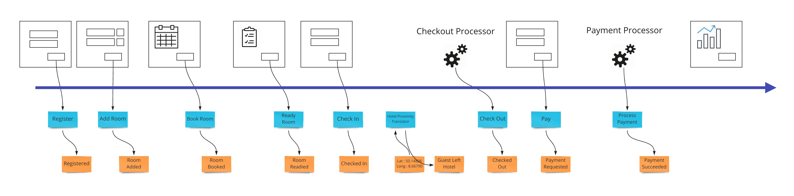
[high res version](Step-4_large.jpg)

From the earlier section we saw that we need to show how we enable the user to change the state of the system. This is usually the step in which we do this introduction of these blue boxes. Each time an event is stored due to a users action, we link that to the UI by a command that shows what we are getting from the screen or implicitly from client state if it's a web application.

### [5. Identify Outputs](#identify-outputs) {#identify-outputs}

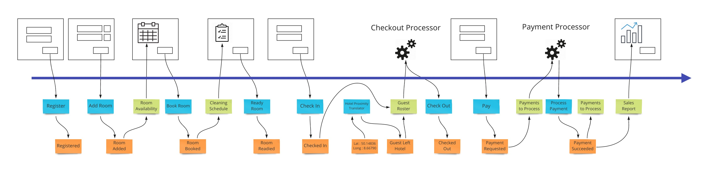
[high res version](Step-5_large.jpg)

Again looking back at our goals for the blueprint, we now have to link information accumulated by storing events back into the UI via views (aka read-models). These may be things like the calendar view in our hotel system that will show the availability of rooms when a user is looking to book a room. 

### [6. Apply Conway's Law](#apply-conways-law) {#apply-conways-law}

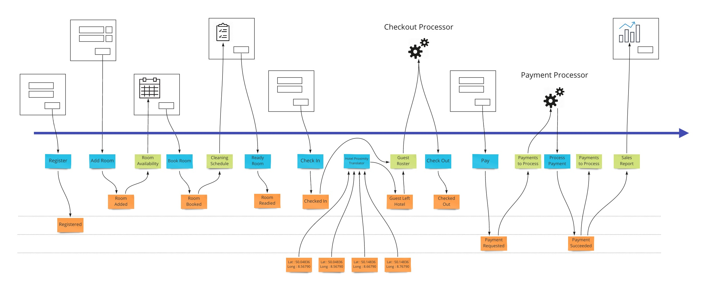
[high res version](Step-6_large.jpg)

Now that we know how information gets in and out of our system, we can start to look at organizing the events themselves into swimlanes. We need to do this to allow the system to exist as a set of autonomous parts that separate teams can own. This allows specialization to happen to a level that we control instead of falling out of the composition of teams. See [Conway's Law](http://melconway.com/Home/Conways_Law.html) by Mel Conway.

### [7. Elaborate Scenarios](#elaborate-scenarios) {#elaborate-scenarios}

Each workflow step is tied to either a command or a view/read-model. The specifications were explained earlier on. How we make them is still collaboratively with all participants in the same space. A Give-When-Then or Given-Then can be constructed one after the other very rapidly while being reviewed by multiple role representatives. This allows what is traditionally done as user story writing by a dedicated product owner in isolation in a text format, to be done visually in a very small amount of time collaboratively. What's very critical here, is that each specification is tied to exactly one command or view.

### [Completeness Check](#completeness-check) {#completeness-check}

At this time the event model should have every field accounted for. All information has to have an origin and a destination. Events must facilitate this transition and hold the necessary fields to do so. This rigor is what is required to get the most benefits of the technique.

A variation of this is where we don't do this final check and rely on absorbing the rework costs. There are scenarios where this is desired.

## [Project Management](#project-management) {#project-management}

The final output of the exercise if done to completion is a set of very small projects defined by all the scenarios for each workflow step. They are in a format that allows them to be directly translated to what developers will use to make their unit tests. They are also coupled to the adjacent workflow steps by only the contract.

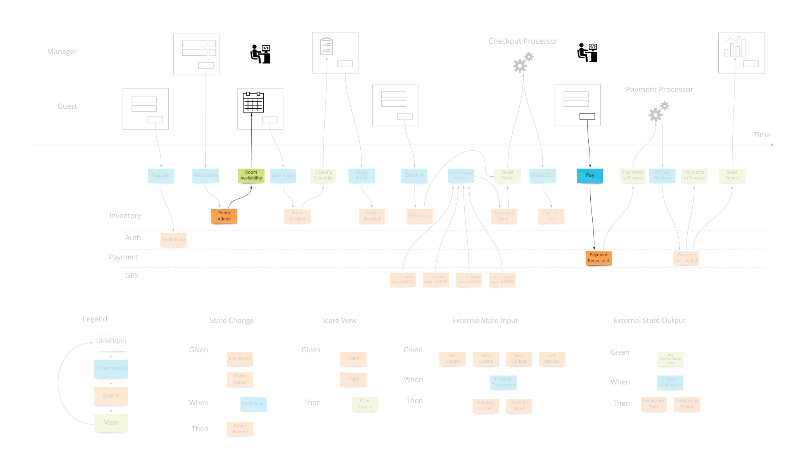
[high res version](parallel_large.jpg)

### [Strong Contracts](#strong-contracts) {#strong-contracts}

Many project management, business and coordination issues are mitigated by the fact that we have made explicit contracts as to the shape of the information of when we start a particular step of the workflow and what is the shape of the data when it's finished. These pre- and post-conditions are what allows the work to be completed in relative isolation and later snap together with the adjoining steps as designed.

#### [Flat Cost Curve](#flat-cost-curve) {#flat-cost-curve}

The biggest impact of using Event Modeling is the flat cost curve of the average feature cost. This is due to the fact that the effort of building each workflow step is not impacted by the development of other workflows. One important thing to understand, is that a workflow step is considered to be repeated on the event model if it uses the same command or view. 

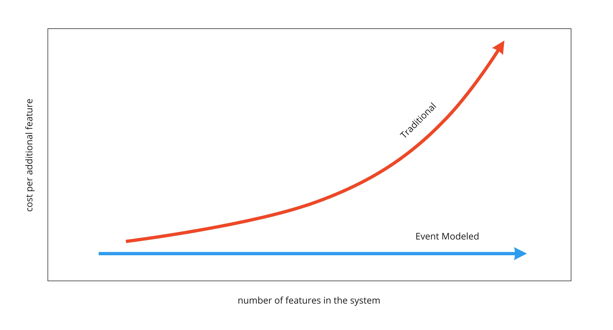

The impact of this is very far reaching because it is what changes software development back into an engineering practice. It's what makes creating an information system work like the construction of a house. Features can be created in any order. Traditional development cannot rely on estimates because whether the feature gets developed early on versus later in the project impacts the amount of work required. Reprioritizing work makes any previous estimates unreliable.

#### [Done is Done Done Right](#done-is-done-done-right) {#done-is-done-done-right}

When a workflow step is implemented, the act of implementing any other workflow step does not cause the need to revisit this already complete workflow step. It's the reason that the constant feature cost curve can be realized.

#### [Estimates without Estimating](#estimates-without-estimating) {#estimates-without-estimating}

With a constant cost curve, the effort for an organization to implement can simply be measured over many features over time. This is an impartial way to empirically determine the velocity of teams. These numbers are then used to scope, schedule and cost out future projects.

##### [Technical Side-Note About Test Driven Development](#technical-side-note-about-test-driven-development) {#technical-side-note-about-test-driven-development}

This is the impact of the adoption of Agile practices in the industry to put band-aids over the core issue of lack of design. Because the scope of each set of requirements is now per workflow step, the refactoring step of TDD does not impact other workflow steps in the event model. When we don't have an event model, refactoring goes unrestricted and previously completed pieces of work have to be adjusted. The more work is already completed, the more that has to be reviewed and adjusted with each new addition as we build the solution.

#### [Subcontracting](#subcontracting) {#subcontracting}

The constant cost curve gives the opportunity to do fixed-cost projects. Once there is a velocity established for a team, you have the cost of the software for your organization. With this number, you now can price out what you are willing to give contractors in pay for each workflow step they complete.

##### [Guarantees](#guarantees) {#guarantees}

Since each workflow step is protected from being affected by other workflow steps, any deficiencies are to be guaranteed by who is delivering them with non-billable work. So in the case of a subcontractor doing a bad job just to get more billable items done quickly, they will have to have the next hours of work dedicated to fixing deficiencies of work already done before. This evens out their effective rate of pay because they are not working on new delivarables.

This can be carried out over longer periods within an employee engagement by making these metrics available through different checkpoints for performance.

Due to the effective pay self-adjusting to the capability of the individual, it is also a way to on-board new employees and pay them fairly while they are in the probation stage of the engagement. This contract-to-hire process removes the subjective and largely ineffective interview process for technical positions.

#### [Prioritization](#prioritization) {#prioritization}

Moving work on a schedule as to what steps are going to be implemented first is done without changing the estimated costs of each item. This ensures that prioritization of work has no impact in the total cost also. The constant cost curve is required to allow this "agility" of reprioritizing features.

#### [Change Management](#change-management) {#change-management}

When the plans change, we simply adjust the event model. This is usually done by just copying the current one and adjusting. Now we can see where the differences are. If a new piece of information is added to one event, that constitutes a new version of the workflow that creates it. Same with the views. If these have not been implemented yet, they don't change our estimate. If they are already implemented, they add another unit of work to our plan because it's considered a replacement. There are a few more rules around this. The end result is a definitive guide for change management.

## [Security](#security) {#security}

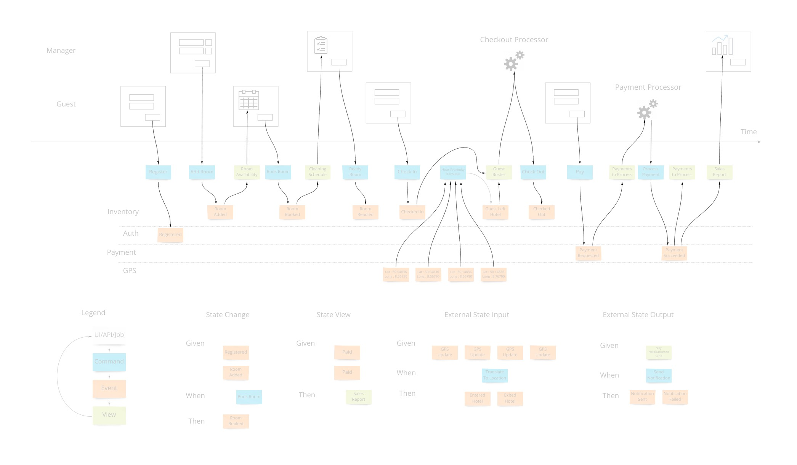
[high res version](arrows_large.jpg)

With an event model, the solution shows exactly where, and equally importantly, when sensitive data crosses boundaries. With traditional audits, the number of interviews with staff was time consuming and at risk of missing important areas. Security concerns are addressed most responsibly when the applications have an event model to reference.

## [Legacy Systems](#legacy-systems) {#legacy-systems}

Most of the scenarios that real organizations face is where a system is already in place. The main way to deal with a system that is hard to manage because of complexity and lack of understanding is to either rewrite it or to refactor it while it runs. Both of these are very costly.

A third, less risky option exists: Freeze the old system. With proper buy-in, the organization can agree to not alter the existing system. Instead, dealing with bugs and adding new functionality is done on the side as a side-car solution.

Events can be gathered from the database of the old system and make views of that state - employing the [translate](#translation) pattern described previously. Y-valve redirection of user action can add new functionality in the side solution. An example which fixes a bug (notice that we use the [external integration pattern](./#automation) and extends the old system to add profile pictures is shown here:

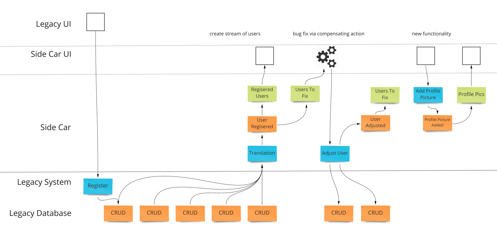

This pattern allows an organization to stop putting energy into the sub-optimal existing system and get unblocked from delivering value via the patterns that enable the benefits of the Event Model.

## [Conclusion for Now](#conclusion-for-now) {#conclusion-for-now}

Event Modeling is changing how information systems are built. With simple repeatable patterns, information systems are as predicable as engineering efforts should be.

(to be continued)

** This is a periodically updated article that will migrate to a page on the site as a resource.
