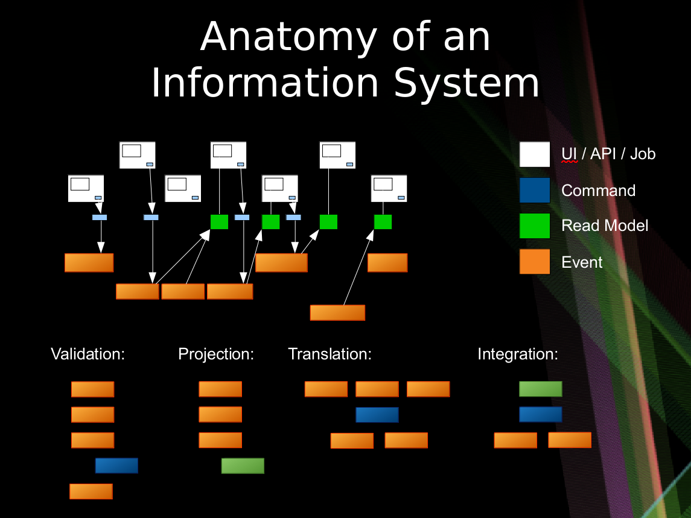
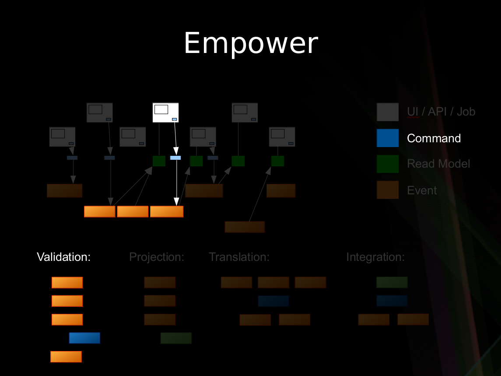
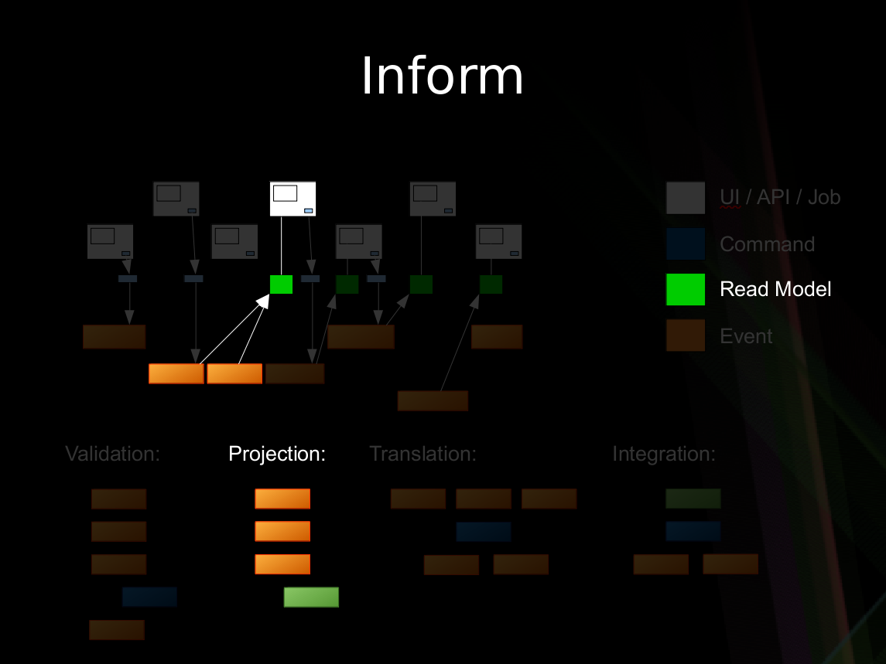
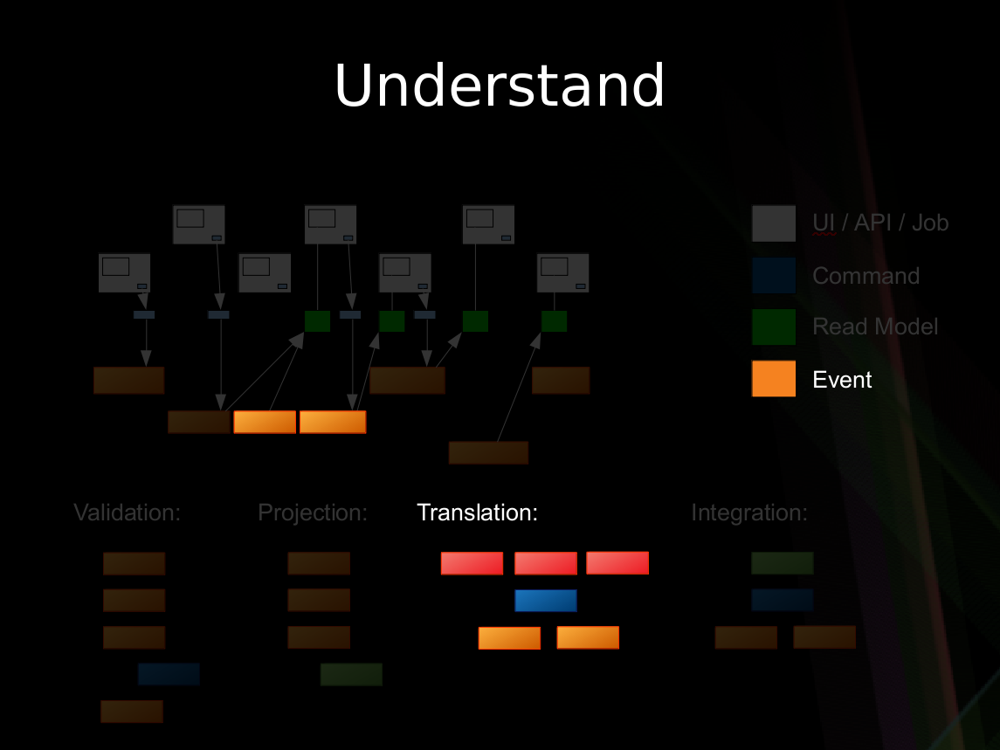

## Motivation

### Moore's Law
Digitized Information Systems are a relatively new concept. Humans have been working with information systems for thousands of years. Over centuries banks, insurance companies and many other large scale organizations have managed to succeed.

With the advent of the transistor, the speed and accuracy of processing information increased by orders of magnitude. What did not gain the same quantum leap is digital storage. This imbalance caused information systems to be optimized for a very small amount of online information. You can see this in the advent of RDBMS technology. What it mean is that the compromise was to throw information away.

### Human Memory

Story telling is something that enables humans to pass knowledge on to subsequent generations and relies heavily on how we store memories - whether logical, visual, auditory or other. This is important because there is a parallel with how information systems were constructed. There is a "memory" of all your visits to the doctor. It's the ledger of the forms that are filled in with each visit.

Specifications by example are a way to show how something is supposed to work. This can be seen in successful practices in software such as Behaviour Driven Development. This works well because we communicate by stories more effectively. It ties back to story telling as a way to keep information in society. Our brains are built for it more than they are built for flow-charts and other formats. 

## Life After the Dawn of the Computer Age

In recent decades, Moore's Law from the side of online storage has caught up. This means that after the initial few decades of living with computer systems, our information systems that are now digitized can use the mechanics that made them effective throughout history.

This means we have enough storage to not throw away information. The ability to be able to keep a history of all that has happened allows systems to be more reliable by means of audit and specification by example that literally translates to how the system is implemented.

We also have enough storage to have a cache of different views into what has happened in the system. This is important as we now have made the task of trying to fit all our concerns into one model an unnecessary constraint. In 1956, an IBM harddrive that stored 10MB cost $1M and required $30K monthly budget.

### Reality of Current Tooling

So we are now at a cross-roads where we have very mature tooling, but that tooling is made for solving a problem we no longer have - being efficient with storage constraints. The new tooling that we see on the rise is what information systems always had: a ledger of what happened - storage is not a major issue anymore. There are many benefits to keeping ledger. They represent the natural way we think about systems - digital or not.

## The Model That Works

Time is a concept that is now a core piece of describing a system. The components and classes that we saw in computing are not as important. We can show, by example, what a system is supposed to do from start to finish, on a time line and with no branching - again to make use of that memory aspect of our brains. This is the Event Model. It is used to follow all field values in the UI to the storage of those value to where they finally end up on a report or a screen. It's generally done with sticky notes on a wall or whiteboard - or an online version of a whiteboard. We'll see that simplicity is at the heart of the approach as we will only use 3 types of building blocks as well as traditional wireframes or mockups. Further to keep things simple, we will rely on only 4 patterns of how we structure the diagram.

### Events

Let's say we want to design a hotel website for a hotel chain for allowing our customers to book rooms online and for us to schedule cleaning and any other hotel concerns. We can show what events, or facts, are stored on a timeline of the year in that business. We can pretend we have the system already and ask ourselves what facts were stored as we move forward through time.

### Wireframes

To bring in the visual part of story-telling we show wireframes or web page mockups across the top. These can be organized in swim-lanes to show different people (or sometimes systems) interacting with our system. We also show any automation here with a symbol like gears to illustrate that the system is doing something. This has an easy to understand set of mechanics of a todo list that a process goes and does and marks items as done. In our hotel example, this could be a payment system or notification system.

At this point we have enough to be able to design some systems with some UX/UI people. But there are 2 very fundamental pieces that must be added to the blueprint which show 2 core features of any information system: Empowering the user and informing the user.

### Commands

Most information systems must give an ability for a user to affect state of the system. In our example, we must allow the booking of a room to change the system so that we don't over-book and when that person arrives at that future date, they have a room ready for them.

Intentions to change the system are encapsulated in a command. As opposed to simply saving form data to a table in a database, this allows us to have a non-technical way to show the intentions while allowing any implementation - although certain ones have advantages as we will see.

From the UI and UX perspective this drives a "command based UI" which goes a long way into helping make composable UIs. With this pattern, it's a lot clearer what the transactional boundaries are both from the technical and business perspectives. The hotel guest either registered successfully or not.

When there are nuances to what the prerequisites are for having a command succeed, they are elaborated on "Given-When-Then" style specifications. This is, again, a way to tell a story of what success looks like. There may be a few of these stories to show how a command can and cannot succeed.

An example might be "**Given**: We have registered, and added a payment method, **When**: We try to book a room, **Then**: a room is booked." This form of specification is also referred to as "Arrange, Act, Assert" and in the UX/UI world "Situation, Motivation, Value".

### Views (or Read Models)

The second part of any information system is the ability to inform the user about the state of the system. Our hotel guest should know about what days are available for certain types of rooms they are interested in staying in. There are usually many of these and support the multi-model aspect of information systems.

A view into the facts already in the system has been changing as these new events were being stored. In our hotel system, this calendar view was being updated as new events that affected inventory were happening. Other views may be for the cleaning staff to see which rooms are ready to be cleaned as events about guests checking out are being stored.

Specifying how a view behaves is very similar to the way we specify how we accept commands with one difference. The views are passive and cannot reject an event after it's been stored in the system. We have "**Given**: hotel is set up with 12 ocean view rooms, ocean view room was booked from April 4th - 12th X 12, **Then**: the calendar should show all dates except April 4th - 12th for ocean view availability".

## Integration

We just covered the first 2 patterns of the 4 that are needed to describe most systems. Systems can get information from other systems and send information to other systems. It would be tempting to force these 2 patterns to be an extension of the first 2 and share the same space. However, these interactions are harder to communicate as they don't have that human-visible aspect to them and require some higher level patterns.

### Translation

When we have an external system that's providing us with information, it's helpful to translate that information into a form that is more familiar in our own system. In our hotel system, we may get events from guests' GPS coordinates if they opted in to our highly reactive cleaning crew. We would not want to use longitude and latitude pairs as events to specify preconditions in our system. We would rather have events that mean something to us like "Guest left hotel", "Guest returned to hotel room".

** This is a periodically updated article that will migrate to a page on the site as a resource.