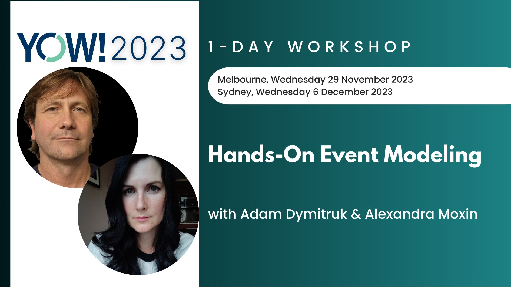

# Table of Contents:
1. [Community](#discord)
2. [Videos](#intro-videos)
3. [Tools](#tools)

# Community
## [Discord](#discord) {#discord}

We have moved our community from Slack to Discord. The Slack channel was created to set an environment where discussions could happen and allow a new avenue for the practice to get adopted. That purpose is better served by Discord which allows community members to interact and coordinate better. You can join the community through this link:

## [Workshops](#workshops) {#workshops}

🦘 [November 29th, Melbourne](https://yowcon.com/melbourne-2023/masterclasses/431/hands-on-event-modeling)

🐨 [December 6th, Sydney](https://yowcon.com/sydney-2023/masterclasses/432/hands-on-event-modeling) 

## [Laptop Stickers](#laptop-stickers) {#laptop-stickers}

You can send these to your own printer to save on shipping and other costs.

[download](stickers.svg)

[download](stickers2.svg)

# [Intro Videos](#intro-videos) {#intro-videos}

Full mini-workshop for InfoZone.se on Event Modeling.



Bobby Calderwood's Mini Course



A community discussion with the Copenhagen DDD meetup group done remotely. Here we start some Event Modeling exercises.



Event Modeling being explained to the DDD Greece meetup group.



This is the first public recording of a talk on Event Modeling. It was recorded at the Event-Driven Meetup in Seattle, WA. James Nugent was presenting on the Raft consensus algorithm that same night.



This is a discussion with Roy Osherove about Event Modeling and Event Sourcing. It gets into details of implementing systems using event storming that are described with event modeling.



# [Tools](#tools) {#tools}

## Online Modeling Tools:

### [ONote](https://onote.com)

**ONote** is a browser based tool for event modeling exclusively. It focuses on the cadance of event modeling and real-time collaboration.

### [Evident Design](https://evidentstack.com/)

**Evident Design** is the next generation successor to ONote. 

### [Modellution (Beta)](https://www.modellution.com)

**Modellution** is a web platform designed for modeling information systems. It allows real-time visual collaboration, estimates, Jira & ClickUp integrations, and code-generation.
There's free commercial version available.

## [Miro Template](#realtime-board-template) {#realtime-board-template}

In the demos of event modeling, [Miro](https://miro.com) is used. If you would like to get started from a small example, you can download the example event model above from [here](/event-modeling.rtb).

## [Implementation Gist](#implementation-gist) {#implementation-gist}

This script only requires [fish shell](https://github.com/fish-shell/fish-shell) and a couple of command line utilities to show the above example work. You can find it in a gist [here](https://gist.github.com/adymitruk//7fc2adb8598ad861d4b3dae114afd4c9).

