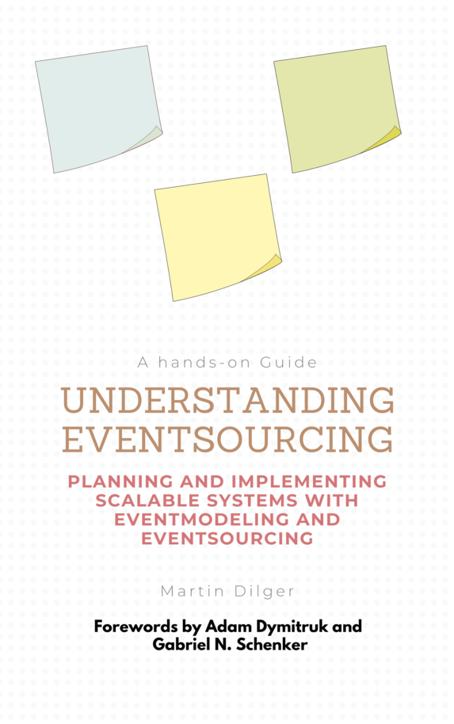
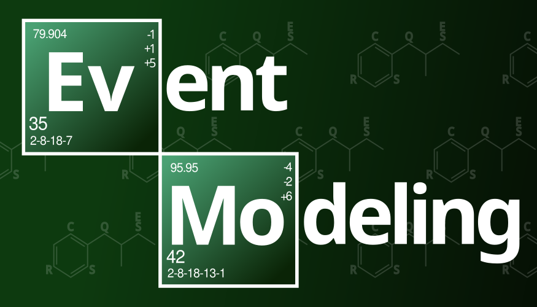
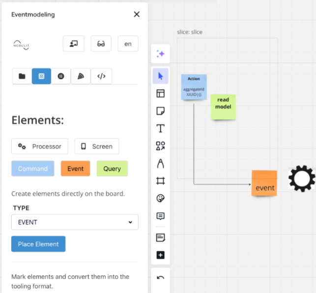
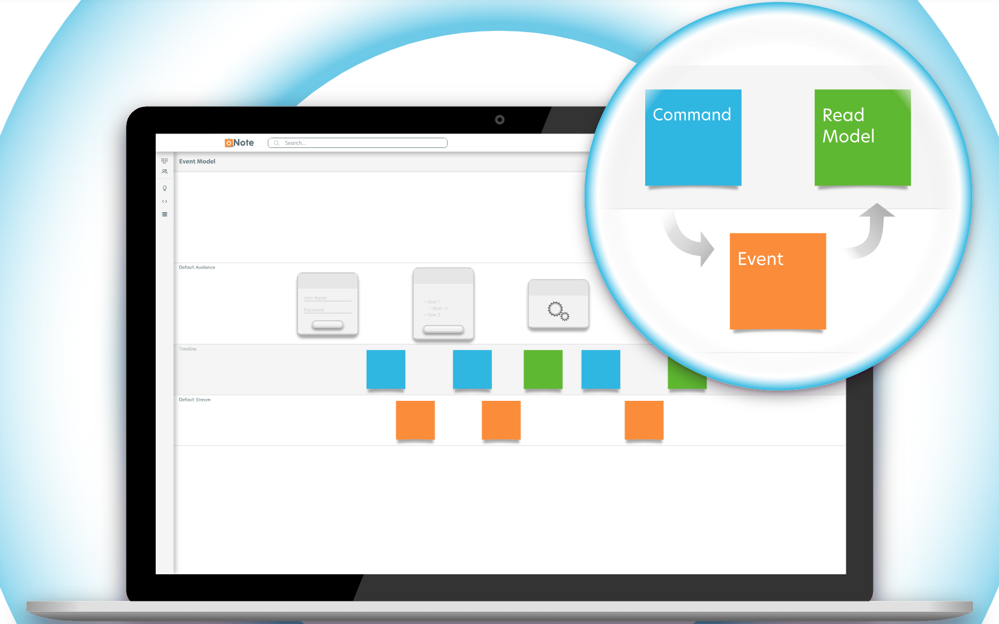
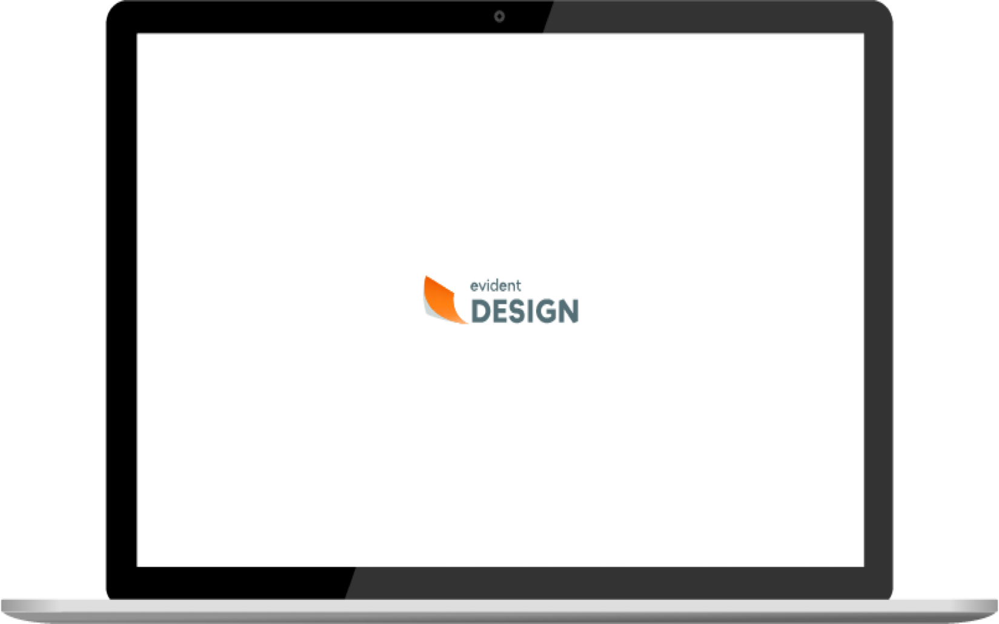
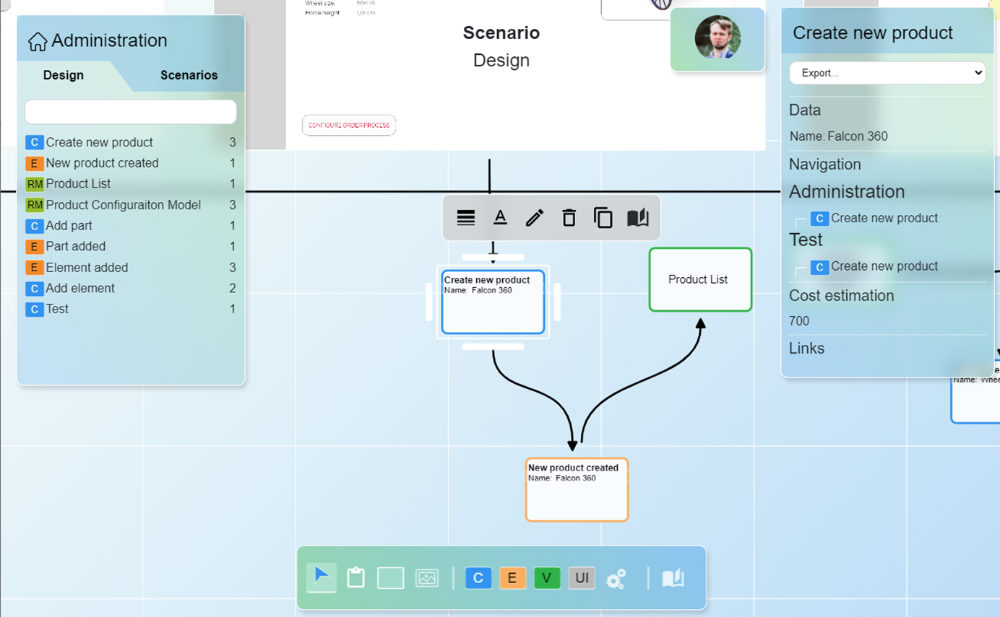
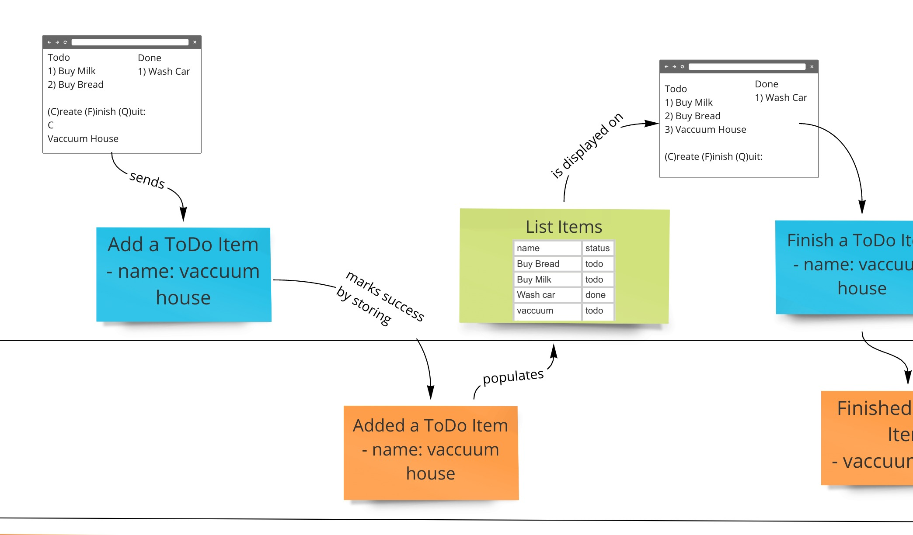
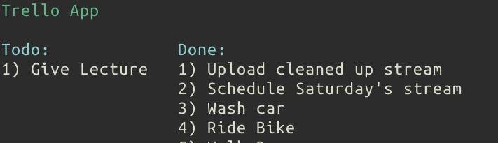

# Table of Contents:
1. [Workshops](#workshops)
2. [Live Streams](#live-streams)
3. [Community](#discord)
4. [Book](#book)
5. [Newsletter](#newsletter)
6. [Laptop Stickers](#laptop-stickers)
7. [Videos](#intro-videos)
8. [Tools](#tools)

# Community

## [Workshops](#workshops) {#workshops}

Online workshop Saturday, 8 am PST, Nov 30th, 2024.
Book your spot [here](https://adaptechgroup.com/#workshops)

## [Podcast](#podcast) {#podcast}

Catch up with the latest episodes of the [Event Modeling Podcast](https://podcast.eventmodeling.org/)

## [Live Streams](#live-streams) {#live-streams}



## [Discord](#discord) {#discord}

We have moved our community from Slack to Discord. The Slack channel was created to set an environment where discussions could happen and allow a new avenue for the practice to get adopted. That purpose is better served by Discord which allows community members to interact and coordinate better. You can join the community through this link:

## [Book](#book) {#book}

Martin Dilger's book on Event Modeling and Event Sourcing is available for purchase [here](https://leanpub.com/event-modeling-and-event-sourcing). It explains both concepts but it's complete enough on Event Modeling to be used as a way to learn the practice.

## [Newsletter](#newsletter)

The [weekly newsletter](https://newsletter.nebulit.de) is a great way to stay up to date with the latest news in the Event Modeling community. It will summarize many topics from the community and the podcast. This should be a great way to keep up if you don't have time to listen to the podcast or keep up with the discord discussions.

## [Laptop Stickers](#laptop-stickers) {#laptop-stickers}

You can send these to your own printer to save on shipping and other costs.

[download](stickers.svg)

[download](stickers2.svg)

# [Intro Videos](#intro-videos) {#intro-videos}

Beginner to expert level presentation on Event Modeling as part of the YOW conference 3 city tour in Australia in December 2023.



Full mini-workshop for InfoZone.se on Event Modeling.



Bobby Calderwood's Mini Course



A community discussion with the Copenhagen DDD meetup group done remotely. Here we start some Event Modeling exercises.



Event Modeling being explained to the DDD Greece meetup group.



This is the first public recording of a talk on Event Modeling. It was recorded at the Event-Driven Meetup in Seattle, WA. James Nugent was presenting on the Raft consensus algorithm that same night.



# [Tools](#tools) {#tools}

## Online Modeling Tools:

### [Miro Plugin from Nebulit.de](https://nebulit.de)

**Event Modeling Plugin for Miro** allows you to create event models and navigate them with ease as well as generate code from the model. Other features include checking references to ensure "information completeness" and moving the elements quickly to efficiently add to the moedel.

S

### [ONote](https://onote.com)

**ONote** is a browser based tool for event modeling exclusively. It focuses on the cadance of event modeling and real-time collaboration.

### [Evident Design](https://evidentstack.com/)

**Evident Design** is the next generation successor to ONote. 

### [Modellution (Beta)](https://www.modellution.com)

**Modellution** is a web platform designed for modeling information systems. It allows real-time visual collaboration, estimates, Jira & ClickUp integrations, and code-generation.
There's free commercial version available.

## [Miro Template](#realtime-board-template) {#realtime-board-template}

In the demos of event modeling, [Miro](https://miro.com) is used. If you would like to get started from a small example, you can download the example event model above from [here](/event-modeling.rtb).

## [FigJam Template](https://www.figma.com/community/file/1210608432896547037) {#figjam-template}

## [Implementation Gist](#implementation-gist) {#implementation-gist}

This script only requires [fish shell](https://github.com/fish-shell/fish-shell) and a couple of command line utilities to show the above example work. You can find it in a gist [here](https://gist.github.com/adymitruk//7fc2adb8598ad861d4b3dae114afd4c9).

